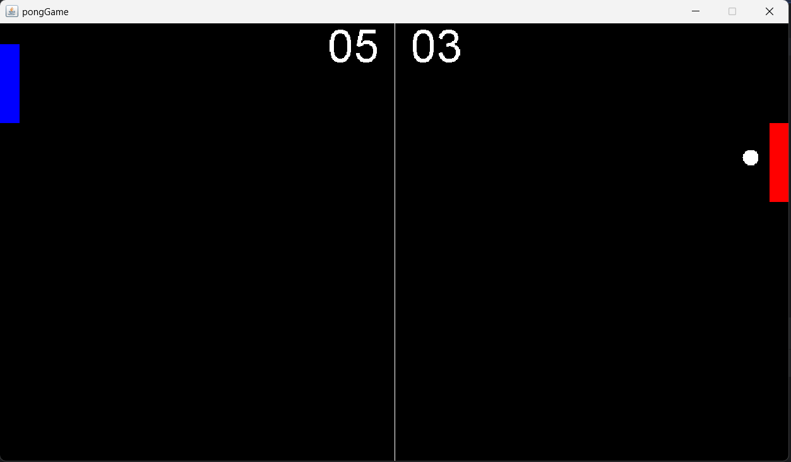

# 🏓 Ping-Pong Game

A simple **Ping-Pong (Pong)** game built in **Java**. This was one of the first games I created while learning Java programming with the help of a tutorial.

It's a fun little project that lets two players compete against each other on the same keyboard.

---

## 📸 Preview

<p align="center">
  
</p>

---

## 🎮 Features

- 🏓 Classic Pong gameplay
- 👥 Two-player local multiplayer
- ⚡ Smooth paddle and ball movement
- 📊 Live score tracking
- 🎨 Simple and clean interface

---

## 🛠️ Built With

- **Java**
- **Java Swing**
- **AWT Graphics**

---

## 🎯 Controls

| Player | Controls |
|---------|----------|
| Left Paddle | **W** / **S** |
| Right Paddle | **↑** / **↓** |

---

## 🚀 Getting Started

### Clone the repository

```bash
git clone https://github.com/Mrnova9810/Ping-Pong.git
```

### Open the project

Open the project in your favorite Java IDE (IntelliJ IDEA, Eclipse, or VS Code).

### Run

Run the `GameFrame.java` (or the main class) to start playing.

---

## 📚 About

This project was my **first game development project in Java**. I built it by following a tutorial while learning the fundamentals of:

- Java OOP
- Swing GUI
- Game loops
- Keyboard input handling
- Collision detection
- Basic game development

It was a great learning experience and a fun introduction to creating games.

---

## 🤝 Contributing

Contributions, suggestions, and improvements are always welcome!

Feel free to fork the repository and submit a pull request.

---

## ⭐ Support

If you enjoyed this project, consider giving it a **⭐ Star** on GitHub!

